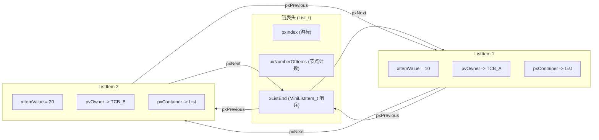

# MiniRTOS 核心笔记（一）：双向链表设计与任务控制块 (TCB) 原理

本文档记录 MiniRTOS 开发阶段一中关于**核心双向链表 (`List_t`)** 与 **任务控制块 (`TCB_t`)** 的底层设计原理、算法思考及关键边界处理。

---

## 1. 双向链表设计原理 (List & ListItem)

在 FreeRTOS / MiniRTOS 中，所有调度队列（就绪列表 `pxReadyTasksLists`、延时列表 `pxDelayedTaskList`、信号量等待列表等）底层全部依赖通用的双向链表。

### 1.1 精简节点 (`MiniListItem_t`) 与末尾哨兵 (`xListEnd`)

传统的双向链表通常采用 `NULL` 指针表示链表头/尾，插入和删除时需要大量的 `if (head == NULL)` 等空指针判断。

MiniRTOS 采用了**带哨兵节点的闭环双向链表**：



#### 思考与设计考量：
1. **为什么存在 `MiniListItem_t`？**
   - 哨兵节点 `xListEnd` 永远属于链表头部/尾部固定成员，它不需要指向任务 TCB（`pvOwner`），也不隶属于其他链表容器（`pxContainer`）。
   - 采用简化的 `MiniListItem_t` 结构在每一个 `List_t` 中省去了两个指针（32位系统下节省 8 字节内存）。
2. **为什么哨兵的 `xItemValue = portMAX_DELAY` (0xFFFFFFFF)？**
   - 在按升序插入函数 `vListInsert` 中，要插入节点的时间戳 `xItemValue` 必然小于或等于 `0xFFFFFFFF`。把哨兵值设为最大值后，所有有效节点都会自动落在哨兵之前，循环寻找插入位置时**永远不会超越哨兵节点**，无需添加越界检查代码。

---

### 1.2 医院排队模型 (数据结构物理类比)

为了直观理解数据结构各字段关系，采用**医院看病排队模型**：

| RTOS 概念 | 医院排队类比 | 职责/作用 |
| :--- | :--- | :--- |
| `TCB_t` | 病人 (Patient) | 实体主体，保存任务状态与栈指针 |
| `ListItem_t` | 排队号牌 (Queue Ticket) | 病人持有的号牌 |
| `ListItem->pvOwner` | 号牌所属病人 | 通过号牌可以反查到对应的病人 TCB |
| `ListItem->pxContainer` | 当前所在诊室/队列 | 标识号牌当前挂在就绪列表还是延时列表 |
| `List_t->pxIndex` | 医生叫号游标 | 当前叫号位置，每次叫号向后移动一步（时间片轮转） |
| `List_t->xListEnd` | 墙上的固定终点标志 | 哨兵节点，闭环连接队首与队尾 |

---

### 1.3 关键算法与野指针防范 (Edge Case Handling)

#### 1. 时间片轮转 `listGET_OWNER_OF_NEXT_ENTRY`
```c
#define listGET_OWNER_OF_NEXT_ENTRY( pxTCB, pxList )                                       \
{                                                                                           \
    List_t * const pxConstList = ( pxList );                                                \
    ( pxConstList )->pxIndex = ( pxConstList )->pxIndex->pxNext;                            \
    if( ( void * ) ( pxConstList )->pxIndex == ( void * ) &( ( pxConstList )->xListEnd ) )  \
    {                                                                                       \
        ( pxConstList )->pxIndex = ( pxConstList )->pxIndex->pxNext;                        \
    }                                                                                       \
    ( pxTCB ) = ( pxConstList )->pxIndex->pvOwner;                                          \
}
```
- 每次移动 `pxIndex` 指向下一个节点。
- 若正好移到了末尾哨兵 `xListEnd`，则再移一步跳过哨兵，自动回滚到第一个有效节点。

#### 2. `uxListRemove` 防野指针处理
在删除节点时，必须检查当前游标 `pxIndex` 是否正好指向被删除的节点：
```c
if( pxList->pxIndex == pxItemToRemove )
{
    pxList->pxIndex = pxItemToRemove->pxPrevious;
}
```
如果忽略此判断，删除节点后 `pxList->pxIndex` 会沦为**野指针**，下一次任务调度引发致命系统崩溃。

---

## 2. 任务控制块 (`TCB_t`) 结构设计原理

任务控制块是操作系统管理任务的核心凭证。

### 2.1 结构体成员定义 (`include/task.h`)
```c
typedef struct tskTCB
{
    volatile StackType_t * pxTopOfStack;    /* ⚠️ 必须作为第 0 个成员！指向当前任务栈顶 */
    ListItem_t             xStateListItem;   /* 状态链表节点 */
    UBaseType_t            uxPriority;       /* 任务优先级 */
    StackType_t          * pxStack;          /* 任务栈起始内存地址 */
    char                   pcTaskName[16];   /* 任务名称 */
} TCB_t;
```

### 2.2 为什么 `pxTopOfStack` 必须是第 0 个成员？

在 ARM Cortex-M 平台的汇编级上下文切换 (`PendSV_Handler`) 中：
- 全局指针 `pxCurrentTCB` 存储当前任务的 `TCB_t` 结构体起始地址。
- 汇编代码在保存/恢复 CPU 寄存器 (R4-R11) 到任务栈时，需要频繁读写 `pxTopOfStack`。
- 将 `pxTopOfStack` 放在结构体偏移量 `0` 的位置，在汇编中可以直接通过 `LDR r0, =pxCurrentTCB; LDR r1, [r0]; LDR r2, [r1]` 读取栈顶指针，无需额外的偏移计算（`LDR r2, [r1, #OFFSET]`），提升了上下文切换这一高频中断的执行效率。

---

## 3. 构建与测试 (Build & Test)

项目配置了自动化 Makefile。

- **编译与编译产物管理**：
  ```bash
  make
  ```
- **自动化运行测试**：
  ```bash
  make run
  ```
- **清理构建产物**：
  ```bash
  make clean
  ```
