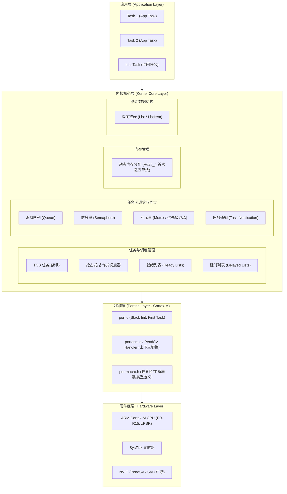
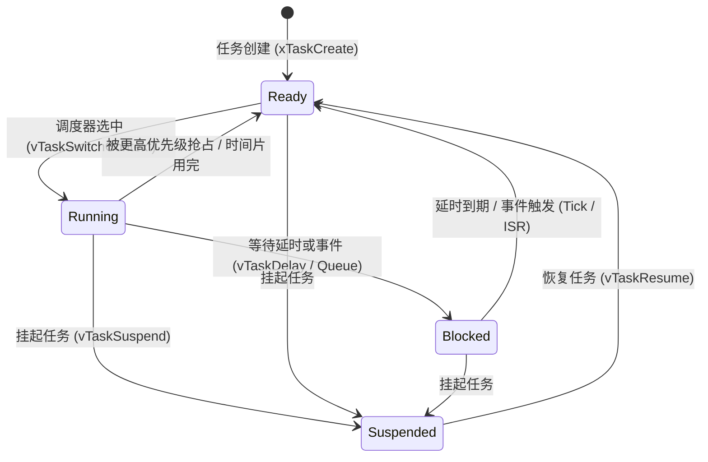
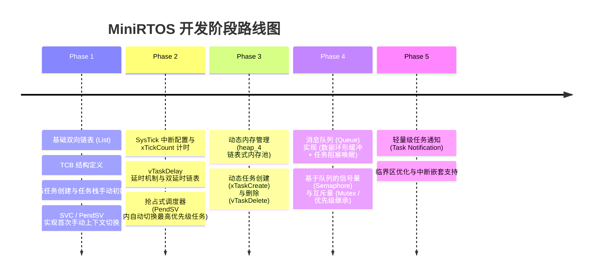

# FreeRTOS / MiniRTOS 架构设计文档

本文档旨在为实现简易版 FreeRTOS（MiniRTOS）提供清晰的系统架构设计指南。结合 FreeRTOS 原理与 Cortex-M 架构特点，将 FreeRTOS 核心抽象为几个模块，并梳理各模块职责、数据结构设计、调度机制及硬件移植层规范。

---

## 1. 整体架构图 (System Architecture)

MiniRTOS 整体架构自底向上分为四层：硬件底层、移植层（Porting Layer）、内核核心层（Kernel Core Layer）以及应用层（Application Layer）。

---

## 2. 核心模块与数据结构设计

### 2.1 基础双向链表 (List & ListItem)

FreeRTOS 内部几乎所有调度和同步结构（就绪列表、阻塞列表、事件列表）都基于通用的双向链表。

#### 数据结构
- **`ListItem_t` (链表节点)**
  - `xItemValue`: 节点值（用于按优先级或延时时间降序/升序排序）。
  - `pxNext`, `pxPrevious`: 双向链表前后指针。
  - `pvOwner`: 指向持有该节点的对象（通常是 `TCB_t` 结构体指针）。
  - `pxContainer`: 指向节点当前所在的链表 (`List_t`)。
- **`MiniListItem_t` (精简节点)**: 用于作为链表的尾节点（末尾哨兵）。
- **`List_t` (链表头)**
  - `uxNumberOfItems`: 当前链表中的节点数量。
  - `pxIndex`: 遍历链表时的当前指针（用于同优先级轮转调度）。
  - `xListEnd`: 链表末尾哨兵节点。

---

### 2.2 任务管理与任务控制块 (TCB & Task Management)

每个任务拥有独立栈空间与一个任务控制块 (`TCB_t`)。

#### 任务状态转换 (Task State Machine)

#### 数据结构 (`TCB_t`)
- `pxTopOfStack`: 当前栈顶指针（上下文切换时保存/恢复寄存器的关键）。
- `xStateListItem`: 状态链表节点（挂载在就绪列表 `pxReadyTasksLists` 或延时列表 `pxDelayedTaskList`）。
- `xEventListItem`: 事件链表节点（挂载在队列/信号量的等待列表中）。
- `uxPriority`: 任务优先级（0 为最低优先级，即空闲任务）。
- `pxStack`: 栈起始地址。
- `pcTaskName`: 任务名称字符串。
- `uxBasePriority`: 基础优先级（用于互斥量优先级继承复原）。

---

### 2.3 调度器与上下文切换 (Scheduler & Context Switch)

FreeRTOS 采用基于优先级的可抢占式调度算法，同优先级支持时间片轮转。

#### 1. 优先级就绪列表
- `pxReadyTasksLists[configMAX_PRIORITIES]`: 数组下标对应优先级，每个元素为 `List_t` 链表。
- 最高优先级选择算法：
  - **通用方法**: 循环从最高优先级查找到 lowest。
  - **Cortex-M 前导零计数指令 (`__CLZ`)**: 使用 `uxTopReadyPriority` 掩码位图，一步查找最高就绪优先级（$O(1)$ 复杂度）。

#### 2. 上下文切换机制 (ARM Cortex-M 机制)
Cortex-M 上下文保存由硬件自动压栈与软件手动压栈共同完成：

- **硬件自动压栈 (CPU Exception Entry)**:
  在响应中断（如 PendSV）时，CPU 自动压入 `xPSR, PC, LR, R12, R3, R2, R1, R0` 到当前任务栈。
- **软件手动压栈 (PendSV_Handler 汇编代码)**:
  手动压入 `R4 ~ R11` (以及浮点寄存器 `S16 ~ S31` 如果开启了 FPU)。
- **更新 `pxTopOfStack`**: 将当前的 `PSP` (Process Stack Pointer) 保存至旧任务的 `TCB->pxTopOfStack`。
- **切换 TCB**: 调用 `vTaskSwitchContext()` 让 `pxCurrentTCB` 指向最高优先级的就绪任务。
- **恢复上下文**: 将 `PSP` 设置为新任务 `TCB->pxTopOfStack`，弹出新任务的 `R4 ~ R11`，最后执行 `bx lr` 触发硬件自动出栈并返回新任务。

---

### 2.4 时间管理与 Tick 滴答中断 (Time Management)

系统依赖硬件定时器（如 Cortex-M 的 SysTick）定时产生中断，驱动系统时间流逝。

#### 双延时链表设计 (Handling Tick Overflow)
为了高效管理任务延时并安全处理 32 位 Tick 计数器溢出问题，系统设计了两个延时链表指针：
- `pxDelayedTaskList`: 当前时间周期内的延时任务链表（按唤醒时间升序排列）。
- `pxOverflowDelayedTaskList`: 唤醒时间跨越 32 位溢出点后的延时任务链表。
- 当系统 `xTickCount` 溢出归零时，交换 `pxDelayedTaskList` 与 `pxOverflowDelayedTaskList` 指针。

#### `xTaskIncrementTick()` 处理流程
1. `xTickCount++` 自增。
2. 检查 `pxDelayedTaskList` 头部节点，若到达唤醒时间，将任务从延时链表移除，加入就绪链表。
3. 若开启同优先级时间片轮转，触发 PendSV 切换上下文。

---

### 2.5 任务间通信与同步 (Queue, Semaphore, Mutex)

FreeRTOS 中队列 (`Queue_t`) 是所有同步与通信机制的基础。

#### 1. 队列 (`Queue_t`) 架构
- **环形缓冲区 (Ring Buffer)**: `pcHead`, `pcTail`, `pcWriteTo`, `pcReadFrom` 控制数据拷贝进出。
- **阻塞等待链表**:
  - `xTasksWaitingToSend`: 因队列满而阻塞的发送任务链表。
  - `xTasksWaitingToReceive`: 因队列空而阻塞的接收任务链表。

#### 2. 信号量与互斥量派生关系
- **二进制/计数信号量 (Semaphore)**: 相当于数据大小 `uxItemSize = 0` 的队列，仅利用队列的 `uxMessagesWaiting` 进行计数。
- **互斥量 (Mutex)**: 带**优先级继承 (Priority Inheritance)** 机制的信号量。
  - 当高优先级任务等待低优先级任务持有的 Mutex 时，临时将低优先级任务的优先级提升至高优先级任务的水平，消除**优先级反转**风险。

---

### 2.6 动态内存管理 (Memory Management - Heap_4)

MiniRTOS 推荐采用类似 FreeRTOS `heap_4.c` 的内存分配策略：
- **首次适应算法 (First-Fit)** + **相邻空闲块合并 (Block Merging)**。
- 内存块头结构 `BlockLink_t`:
  - `pxNextFreeBlock`: 指向下一个空闲块。
  - `xBlockSize`: 当前块大小（最高位作为分配标记位 `xBlockAllocated`）。
- 保证分配时的内存对齐（如 8 字节对齐）。

---

## 3. Cortex-M 硬件移植层 (Porting Layer Specification)

硬件移植层主要处理平台相关的底层次操作，集中在三个文件中：

| 文件名 | 职责 |
| :--- | :--- |
| `portmacro.h` | 定义基本数据类型 (`TickType_t`, `BaseType_t`)、中断屏蔽宏及临界区控制 |
| `port.c` | 实现任务栈初始化 (`pxPortInitialiseStack`)、系统启动 (`vPortStartFirstTask`) |
| `portasm.s` | 汇编实现 `PendSV_Handler`（上下文切换）、`vPortSVCHandler`（启动首个任务） |

### 临界区管理 (Critical Sections)
Cortex-M 中通过设置 `BASEPRI` 寄存器关中断，防止高优先级 ISR 打断内核数据结构操作：
- `portSET_INTERRUPT_MASK_FROM_ISR()`: 设置 `BASEPRI = configMAX_SYSCALL_INTERRUPT_PRIORITY`，仅屏蔽优先级低于/等于该阈值的中断，保留实时性要求极高的中断（Zero-latency interrupts）。
- `portCLEAR_INTERRUPT_MASK_FROM_ISR(uxSavedInterruptStatus)`: 恢复之前的 `BASEPRI` 值。

---

## 4. MiniRTOS 分阶段实现 Roadmap

为了降低开发复杂度，实现简易 FreeRTOS 建议按照以下步骤循序渐进：

---

## 5. 总结

 MiniRTOS 的核心在于**任务上下文的汇编级保存与恢复**以及**基于双向链表的内核状态管理**。通过清晰划分内核层与移植层，MiniRTOS 能够优雅地在 ARM Cortex-M 架构上完成多任务调度与同步。
